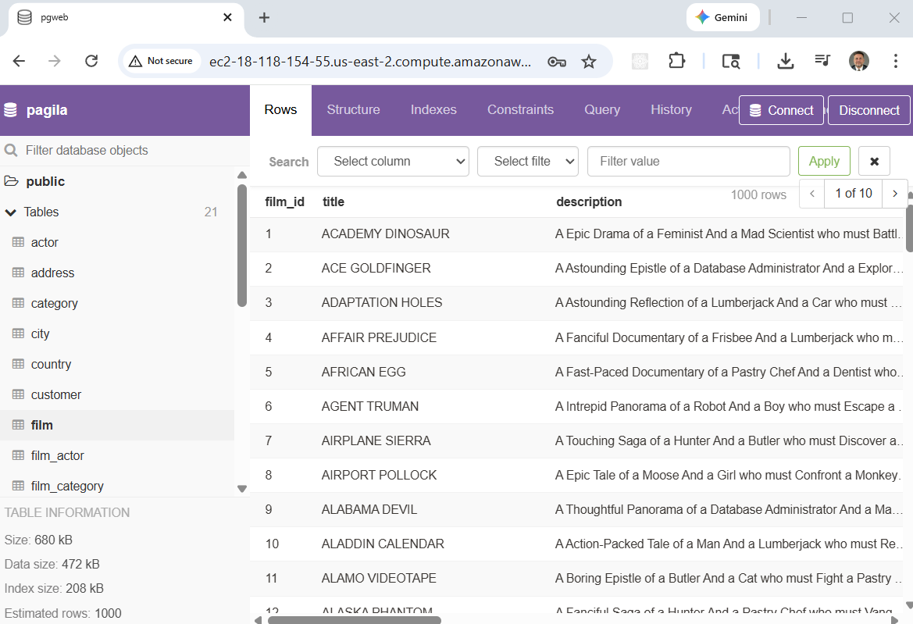
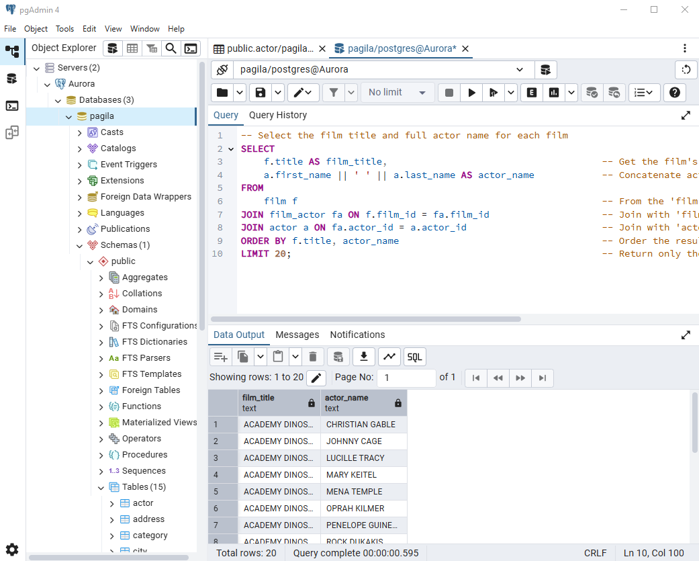

## Deploying PostgreSQL in AWS — Quick Start

This project is a **quick start guide** to deploying PostgreSQL on AWS using
fully managed database services. In just a few steps, you’ll provision working
PostgreSQL backends using **Amazon RDS for PostgreSQL** and
**Amazon Aurora PostgreSQL-Compatible Edition**—no manual database setup
required.

The goal here isn’t deep comparison or tuning. It’s to give you **immediately
usable PostgreSQL endpoints** built with infrastructure as code, following AWS
best practices for managed databases.

You’ll deploy:
- A standalone PostgreSQL instance using Amazon RDS  
- A highly available PostgreSQL cluster using Amazon Aurora  

To make the environment instantly testable, the project also loads the
[Pagila](https://www.postgresql.org/ftp/projects/pgFoundry/dbsamples/pagila/)
sample database—a realistic PostgreSQL dataset based on a fictional DVD rental
store—so you can validate connectivity, run queries, and explore the database
right away.

If you want a fast, repeatable way to stand up PostgreSQL on AWS for demos,
learning, or prototyping, this project gets you there in minutes.


## What You'll Learn

- The core differences between RDS PostgreSQL and Aurora PostgreSQL
- How to provision each database using Terraform
- The distinction between Aurora readers and RDS read replicas
- Best practices for security, scalability, and infrastructure-as-code deployment

## Comparison of RDS for PostgreSQL and Aurora PostgreSQL

When deploying PostgreSQL on AWS, Amazon RDS for PostgreSQL and Amazon Aurora PostgreSQL-Compatible Edition are two fully managed options. Both simplify database management, but they differ in architecture, performance, and cost. This document compares them to help you choose the right service for your application.

### Overview

- **Amazon RDS for PostgreSQL**: A managed service offering standard PostgreSQL with automated backups, patching, and scaling. Ideal for cost-effective, general-purpose workloads.

- **Amazon Aurora PostgreSQL**: A high-performance, PostgreSQL-compatible engine with distributed storage, designed for scalability and enterprise-grade applications.

## Key Differences

| **Aspect**                     | **Amazon RDS for PostgreSQL**                                                                                                    | **Amazon Aurora PostgreSQL-Compatible**                                                                                                                |
|--------------------------------|----------------------------------------------------------------------------------------------------------------------------------|---------------------------------------------------------------------------------------------------------------------------------------------------------|
| **Architecture and Storage**   | Standard PostgreSQL with EBS storage; storage provisioned manually (up to 64 TB) and scaling may involve downtime               | Distributed storage across multiple AZs; auto-scaling up to 128 TB with no downtime                                                                    |
| **Performance**                | Reliable for standard workloads; limited by EBS and single-instance architecture                                                | Up to 5× throughput; features like parallel query execution                                                                                             |
| **High Availability & Replication** | Multi-AZ deployments; failover in 60–120 seconds; asynchronous read replicas                                                     | Faster failover (<30 s); up to 15 low-latency read replicas; Aurora Global Database for cross-region replication                                        |
| **Scalability**                | Vertical scaling and read replicas; storage scaling may involve downtime                                                        | Seamless compute and storage scaling; Aurora Serverless supports variable workloads                                                                     |
| **Cost**                       | More affordable for smaller, predictable workloads                                                                              | Higher cost reflecting advanced performance; Aurora Serverless can reduce costs for variable usage                                                     |
| **Features & Compatibility**   | Full PostgreSQL compatibility with most extensions                                                                              | PostgreSQL-compatible but may lack some extensions; unique features such as Backtrack and parallel query                                               |
| **Backup & Recovery**          | Automated backups (up to 35 days) and point-in-time recovery; slower restores for large databases                               | Faster backups and restores; Backtrack enables near-instant point-in-time recovery                                                                     |
| **Use Cases**                  | Best for cost-conscious, general-purpose workloads and development environments                                                 | Ideal for high-performance, mission-critical workloads; Serverless option for variable demand                                                          |


## Choosing the Right Service

- **Choose RDS if**: You need a cost-effective, fully compatible PostgreSQL solution for standard workloads.
- **Choose Aurora if**: Your application demands high performance, scalability, or advanced features like global replication.


## Prerequisites

* [An AWS Account](https://aws.amazon.com/console/)
* [Install AWS CLI](https://docs.aws.amazon.com/cli/latest/userguide/getting-started-install.html) 
* [Install Latest Terraform](https://developer.hashicorp.com/terraform/install)
* Optionally - [pgAdmin4 client](https://www.pgadmin.org/download/)

If this is your first time watching our content, we recommend starting with this video: [AWS + Terraform: Easy Setup](https://youtu.be/BCMQo0CB9wk). It provides a step-by-step guide to properly configure Terraform, Packer, and the AWS CLI.

## Download this Repository

```bash
git clone https://github.com/mamonaco1973/aws-postgres.git
cd aws-postgres
```

## Build the Code

Run [check_env](check_env.sh) then run [apply](apply.sh).

```bash
~/aws-postgres$ ./apply.sh
NOTE: Validating that required commands are found in your PATH.
NOTE: aws is found in the current PATH.
NOTE: psql is found in the current PATH.
NOTE: terraform is found in the current PATH.
NOTE: jq is found in the current PATH.
NOTE: All required commands are available.
NOTE: Checking AWS cli connection.
NOTE: Successfully logged into AWS.
NOTE: Building Database Instances.
Initializing the backend...
Initializing provider plugins...
- Reusing previous version of hashicorp/aws from the dependency lock file
- Reusing previous version of hashicorp/random from the dependency lock file
- Using previously-installed hashicorp/aws v6.0.0
- Using previously-installed hashicorp/random v3.7.2
Terraform has been successfully initialized!
```
## Build Results

After applying the Terraform configuration, the following AWS resources are
provisioned.

### VPC & Networking
- Custom VPC: `rds-vpc`
- Two public subnets for highly available deployments:
  - `rds-subnet-1` (AZ A)
  - `rds-subnet-2` (AZ B)
- Internet Gateway: `rds-igw`
- Public route table with a default internet route

### Security Groups
- **Database Security Group**: `rds_sg`
  - Allows inbound PostgreSQL traffic on port **5432**
- **Web Security Group**: `pgweb_sg`
  - Allows inbound HTTP traffic on port **80** for pgweb access

### Secrets & Credentials
- AWS Secrets Manager secrets:
  - `aurora-credentials`
  - `postgres-credentials`
- Each secret contains:
  - Database endpoint
  - Admin username
  - Randomly generated password
- Credentials are generated at deploy time using `random_password` and stored
  securely via `aws_secretsmanager_secret_version`

### Amazon RDS for PostgreSQL
- Primary RDS PostgreSQL instance
- Read replica for failover and read scalability
- RDS subnet group spanning both public subnets
- Publicly accessible endpoint for demonstration and testing

### Amazon Aurora PostgreSQL
- Aurora PostgreSQL–compatible cluster
- Aurora Serverless v2 configuration
- One writer instance and one reader instance
- Aurora subnet group spanning both public subnets

### pgweb Deployment (Web UI)
- EC2 instance: `pgweb-deployment`
  - Ubuntu 24.04
  - Deployed into the same VPC
- pgweb installed and managed via `systemd`
- Exposes a lightweight PostgreSQL web UI over **HTTP (port 80)**
- Automatically connects to both:
  - RDS PostgreSQL
  - Aurora PostgreSQL
- Sample **Pagila** dataset is loaded into each database during instance
  initialization

### Validation Output
- A helper validation script resolves and prints:
  - The public pgweb URL
  - The RDS PostgreSQL endpoint
  - The Aurora PostgreSQL cluster endpoint

## Test Clients

A lightweight test EC2 instance is deployed with pgweb, a minimal web-based client for interacting with PostgreSQL databases.



*Optionally* you can use the pgAdmin4 client.



Query 1:
```sql
-- Select the film title and full actor name for each film
SELECT
    f.title AS film_title,                                      -- Get the film's title from the 'film' table
    a.first_name || ' ' || a.last_name AS actor_name            -- Concatenate actor's first and last name as 'actor_name'
FROM
    film f                                                      -- From the 'film' table aliased as 'f'
JOIN film_actor fa ON f.film_id = fa.film_id                    -- Join with 'film_actor' to link films to their actors
JOIN actor a ON fa.actor_id = a.actor_id                        -- Join with 'actor' table to get actor details
ORDER BY f.title, actor_name                                    -- Order the results alphabetically by film title, then actor name
LIMIT 20;                                                       -- Return only the first 20 results
```

Query 2:

```sql
-- Select film titles and a comma-separated list of all actors in each film
SELECT
    f.title,                                                              -- Get the film's title from the 'film' table
    STRING_AGG(a.first_name || ' ' || a.last_name, ', ') AS actor_names  -- Combine all actor full names into one comma-separated string
FROM
    film f                                                                -- From the 'film' table aliased as 'f'
JOIN film_actor fa ON f.film_id = fa.film_id                              -- Join with 'film_actor' to link each film to its actors
JOIN actor a ON fa.actor_id = a.actor_id                                  -- Join with 'actor' table to get actor names
GROUP BY f.title                                                           -- Group results by film title so each row is one film
ORDER BY f.title                                                           -- Sort the results alphabetically by film title
LIMIT 20;                                                                  -- Return only the first 10 films
```

