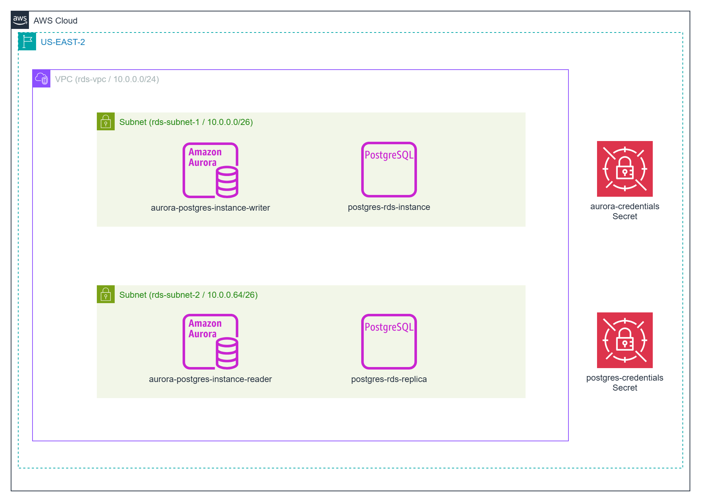

# Deploying Postgres in AWS


This project provides a comprehensive guide to deploying PostgreSQL on AWS using two fully managed database services: Amazon RDS for PostgreSQL and Amazon Aurora PostgreSQL-Compatible Edition. These services enable developers and organizations to set up, operate, and scale PostgreSQL databases in the cloud with ease, eliminating the need for manual infrastructure management.

Whether you're creating a lightweight development environment for testing or a robust, production-grade backend for mission-critical applications, AWS offers flexible deployment options tailored to diverse needs. 

Each service—Amazon RDS for PostgreSQL and Amazon Aurora PostgreSQL-Compatible Edition—comes with distinct performance characteristics, feature sets, and cost profiles, allowing you to choose the best fit for your use case. Amazon RDS provides a straightforward, managed PostgreSQL experience with automated backups, patching, and scaling, while Aurora offers enhanced performance and high availability through its distributed storage architecture.

As part of this project, we deploy the [Pagila](https://www.postgresql.org/ftp/projects/pgFoundry/dbsamples/pagila/) sample database, a well-known PostgreSQL dataset modeled after a fictional DVD rental store. This allows you to test and explore the functionality of your deployed database in a practical, real-world-inspired scenario.



## What You'll Learn

- The core differences between RDS PostgreSQL and Aurora PostgreSQL
- How to provision each database using Terraform
- The distinction between Aurora readers and RDS read replicas
- Best practices for security, scalability, and infrastructure-as-code deployment

## Prerequisites

* [An AWS Account](https://aws.amazon.com/console/)
* [Install AWS CLI](https://docs.aws.amazon.com/cli/latest/userguide/getting-started-install.html) 
* [Install Latest Terraform](https://developer.hashicorp.com/terraform/install)
* [postgres `pqsl' client](https://www.postgresql.org/download/linux/ubuntu/)
* [pgAdmin4 client](https://www.pgadmin.org/download/)

If this is your first time watching our content, we recommend starting with this video: [AWS + Terraform: Easy Setup](https://youtu.be/BCMQo0CB9wk). It provides a step-by-step guide to properly configure Terraform, Packer, and the AWS CLI.

## Download this Repository

```bash
git clone https://github.com/mamonaco1973/aws-postgres.git
cd aws-postgres
```

## Build the Code

Run [check_env](check_env.sh) then run [apply](apply.sh).

```bash
~/aws-packer$ ./apply.sh
NOTE: Validating that required commands are found in your PATH.
NOTE: aws is found in the current PATH.
NOTE: packer is found in the current PATH.
NOTE: terraform is found in the current PATH.
NOTE: jq is found in the current PATH.
NOTE: All required commands are available.
NOTE: Checking AWS cli connection.
NOTE: Successfully logged into AWS.
NOTE: Building networking infrastructure.
Initializing the backend...
Initializing provider plugins...
- Finding latest version of hashicorp/aws...
- Finding latest version of hashicorp/random...
- Installing hashicorp/aws v5.96.0...
- Installed hashicorp/aws v5.96.0 (signed by HashiCorp)
- Installing hashicorp/random v3.7.2...
- Installed hashicorp/random v3.7.2 (signed by HashiCorp)
Terraform has created a lock file .terraform.lock.hcl to record the provider
selections it made above. Include this file in your version control repository
so that Terraform can guarantee to make the same selections by default when
you run "terraform init" in the future.

Terraform has been successfully initialized!
```

