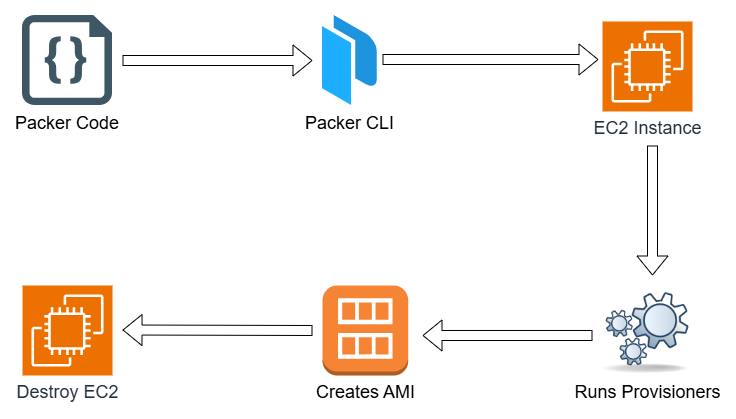
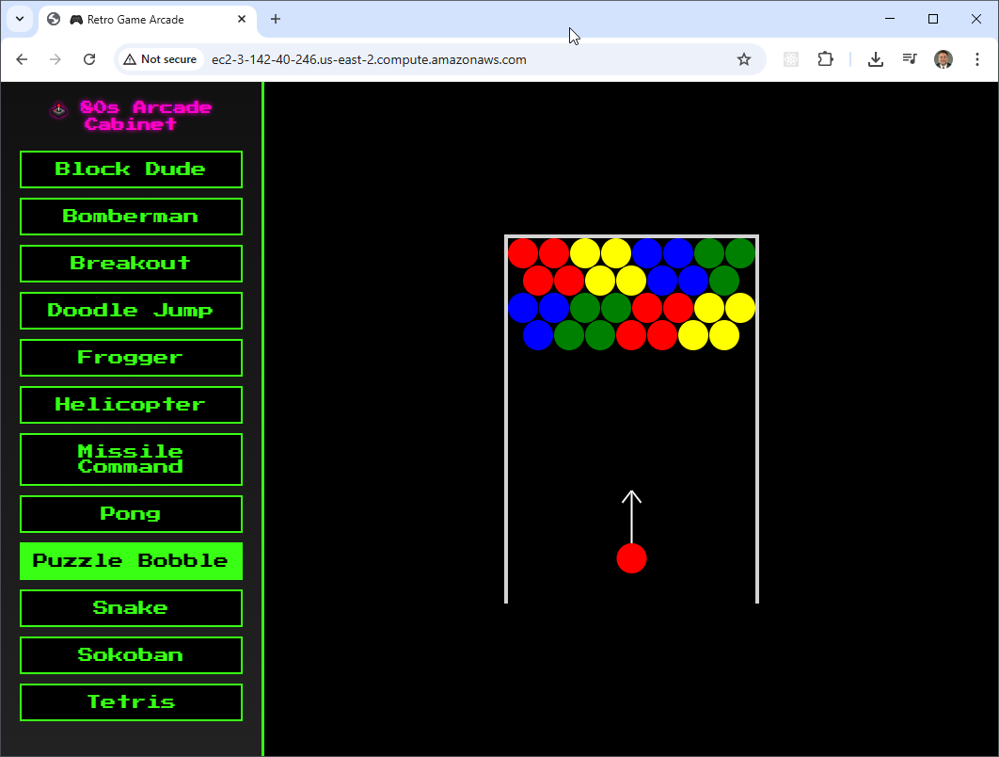
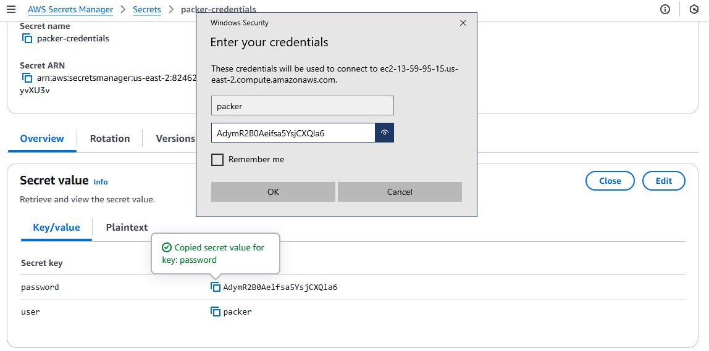
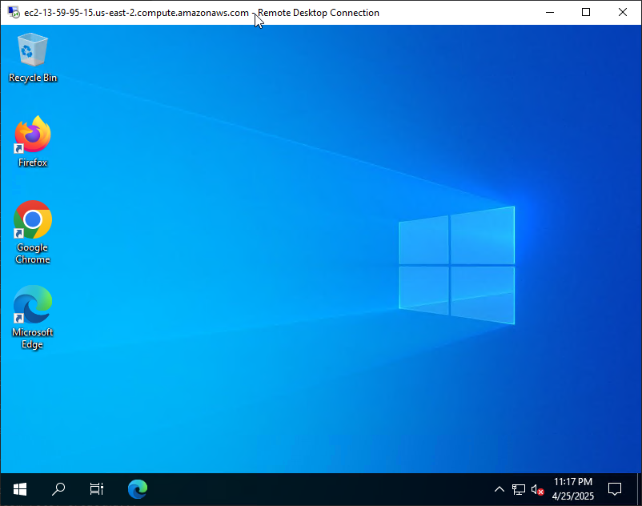

# Building AMIs with Packer in AWS  

In the AWS solution, we use Packer to build both **Linux AMIs** and **Windows AMIs**. 

- For **Linux**, we configure an Ubuntu-based image with Apache and deploy several retro HTML games. The source for the html games can be found at [https://gist.github.com/straker](https://gist.github.com/straker)
- For **Windows**, we install Chrome and Firefox, apply the **latest Windows Updates**, and configure WinRM using a custom **user data script**.
- We use the built-in **EC2 Launch tool** to perform Sysprep on Windows images, ensuring a clean and reusable AMI every time.
- Both images are configured with **AWS Systems Manager (SSM)** support, allowing you to connect and debug directly from the AWS Console without needing SSH or RDP.
- The images are built inside a user-defined **VPC and subnet**, which is created beforehand.
- We test deployments by accessing the Linux instance over **HTTP (port 80)** and the Windows instance via **RDP** using a local `packer` account with a secure password.


## Packer Workflow



## Prerequisites

* [An AWS Account](https://aws.amazon.com/console/)
* [Install AWS CLI](https://docs.aws.amazon.com/cli/latest/userguide/getting-started-install.html) 
* [Install Latest Terraform](https://developer.hashicorp.com/terraform/install)
* [Install Latest Packer](https://developer.hashicorp.com/packer/install)

If this is your first time watching our content, we recommend starting with this video: [AWS + Terraform: Easy Setup](https://youtu.be/BCMQo0CB9wk). It provides a step-by-step guide to properly configure Terraform, Packer, and the AWS CLI.

## Download this Repository

```bash
git clone https://github.com/mamonaco1973/aws-packer.git
cd aws-packer
```

## Build the Code

Run [check_env](check_env.sh) then run [apply](apply.sh).

```bash
~/aws-packer$ ./apply.sh
NOTE: Validating that required commands are found in your PATH.
NOTE: aws is found in the current PATH.
NOTE: packer is found in the current PATH.
NOTE: terraform is found in the current PATH.
NOTE: jq is found in the current PATH.
NOTE: All required commands are available.
NOTE: Checking AWS cli connection.
NOTE: Successfully logged into AWS.
NOTE: Building networking infrastructure.
Initializing the backend...
Initializing provider plugins...
- Finding latest version of hashicorp/aws...
- Finding latest version of hashicorp/random...
- Installing hashicorp/aws v5.96.0...
- Installed hashicorp/aws v5.96.0 (signed by HashiCorp)
- Installing hashicorp/random v3.7.2...
- Installed hashicorp/random v3.7.2 (signed by HashiCorp)
Terraform has created a lock file .terraform.lock.hcl to record the provider
selections it made above. Include this file in your version control repository
so that Terraform can guarantee to make the same selections by default when
you run "terraform init" in the future.

Terraform has been successfully initialized!
```

### Build Process Overview

The build process is divided into three phases:

1. **Phase 1:** Use Terraform to provision network infrastructure and `packer` credentials as a secret.
2. **Phase 2:** Use packer to build the `games` AMI and `desktop` AMIs using the network infrastructure from Phase 1. This part of the build takes the longest - at least 20 minutes.
3. **Phase 3:** Create EC2 instances using the AMIs from Phase 2.

## Tour of Build Output in the AWS Console


## Test the Games Server

To test the games simply navigate to the public IP address of deployed instance in a web browser.



## Test the Desktop Server

To test the Desktop server you'll need to create an RDP session to the deployed instance. When prompted for credentials, use `packer` as the user id and then look up the password in the AWS console by viewing the `packer-credentials` secret.



